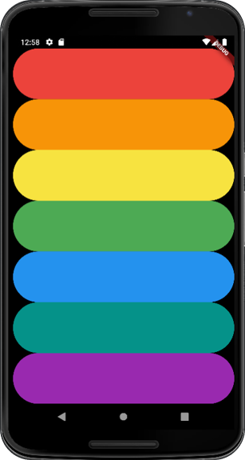

# Xylophone 🎹

A music app that plays Xylophone sounds. 
For every Beethoven out there, this will let you unleash your musical talent where ever you are.

## What has been implemented in this app?

1.Incorporate open source libraries of code into the project using Flutter Packages. 
2.Play sound on Android.
3.Generate repeated user interface Widgets.
4.Use Dart functions that can take input arguments as well as return an output.

##Screenshots

